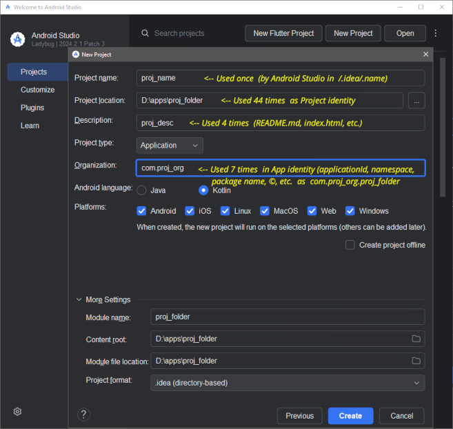

## Flutter: Upgrading old projects

---

### Basic Approach

- Ensure the Flutter development environment is up to date.
- Create a new Flutter project in a separate folder using the original project's "setup properties".
- Migrate properties, scripts, texts, assets, code & keys the new project.
- Deal with remaining issues.

---

### Tasks

#### Gather 4 strings from the original project:

See Appendix 1

- Root folder name - "App ID"
  - original _project's root folder name_
- Project name
  - _`name`_ property in _`pubspec.yaml`_
  - usually the same as the proj_folder name
  - Only used by Android Studio / IntelliJ IDEA
- Project description
  - _`description`_ property in _`pubspec.yaml`_
- Project's organization "ID"
  - See the _`organisation`_, _`applicationId`_,  
    _`namespace`_ and _`package`_ properties in
    - _`/android/app/build.gradle`_,
    - _`MainActivity.*`_, and
    - the 3 _`AndroidManifeast.xml`_ files.
  - Has the form: _com.proj_org.proj_folder_

---

#### Upgrade Flutter

Use the flutter script command: _`flutter upgrade`_

---

#### Create new Flutter Project using Android Studio (AS)

See: Appendix 1

- Use the "New Flutter Button" in AS
- Set project's name as per the original app
  - If the original app's _project folder name_ differs from its _`name`_ property in _`pubspec.yaml`_ then use the _`name`_ property.
- Set project's _`description`_
- Set the _project folder name_
- Set Organization

---

#### Update new project's Name XXXX

Not necessary in this Migration method that creates a new Flutter app using the new _`name`_, _`description`_ & _`organization`_

---

#### Migrate the app

Migrate _`assets`_, _`icons`_, _`fonts`_ and _`lib`_ folders, etc.  
Migrate _`README.md`_, etc.

---

#### Migrate permissions

Migrate app permissions across the variuos _`AndroidManifest.xml`_ files

---

#### If key(s) exist:

- Migrate the _`key.properties`_ file
- Manage the _`key.jks`_ file
- Migrate _`keystoreProperties`_ in _`/android/app/build.gradle`_

  - Insert the _`keystoreProperties`_ above the _`android`_ block:

  ```
      def keystoreProperties = new Properties()
      def keystorePropertiesFile = rootProject.file('key.properties')
      if (keystorePropertiesFile.exists()) {
        keystoreProperties.load(new FileInputStream(keystorePropertiesFile))
      }

      android {
        ...
      }

  ```

- Migrate the _`signingConfigs`_ block in _`/android/app/build.gradle`_
  - Insert a _`signingConfigs`_ block above the _`buildTypes`_ block:
  ```
      signingConfigs {
        release {
          keyAlias keystoreProperties['keyAlias']
          keyPassword keystoreProperties['keyPassword']
          storeFile keystoreProperties['storeFile'] ?
              file(keystoreProperties['storeFile']) :
              null
          storePassword keystoreProperties['storePassword']
        }
      }
  ```

---

#### Compile and Debug

If issues persist, the _[flutter_migrate](https://pub.dev/packages/flutter_migrate)_ tool may be useful.

Good luck!

---

##### References:

Alien Code, (13 Aug 2024). _Easy migration of old Flutter project..._  
[https://aliencode52.blogspot.com/2024/04/easy-migration-of-old-flutter-project.html](https://aliencode52.blogspot.com/2024/04/easy-migration-of-old-flutter-project.html)

Gupta, A. (2024). _Migrating old Flutter project to the latest version._ [https://dev.to/ankurg132/migrating-old-flutter-project-to-the-latest-version-1d06](https://dev.to/ankurg132/migrating-old-flutter-project-to-the-latest-version-1d06)

van den Eijnde, T. (31 Oct 2024). _How to Change the Name of Your Flutter Application_ [https://onlyflutter.com/how-to-change-the-name-of-your-flutter-application/](https://onlyflutter.com/how-to-change-the-name-of-your-flutter-application/)

---

Appendix 1



---

#### Last update

_PS Gray, 13 Jan 2025_

---

Comments/Sugestions welcome...
