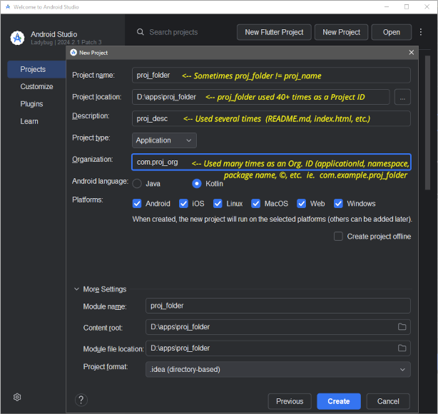

## Flutter: Upgrading old projects

---

### Basic Approach

- Ensure the Flutter development environment is up to date.
- Create a new Flutter project in a new folder using the original's naming properties.
- Migrate the old project's assets, code, permissions & keys the new project.
- Deal with remaining issues.

For further info see [./upgrading_flutter_projects.md](upgrading_flutter_projects.md)

> 

---

#### Last update

_PS Gray, 13 Jan 2025_
